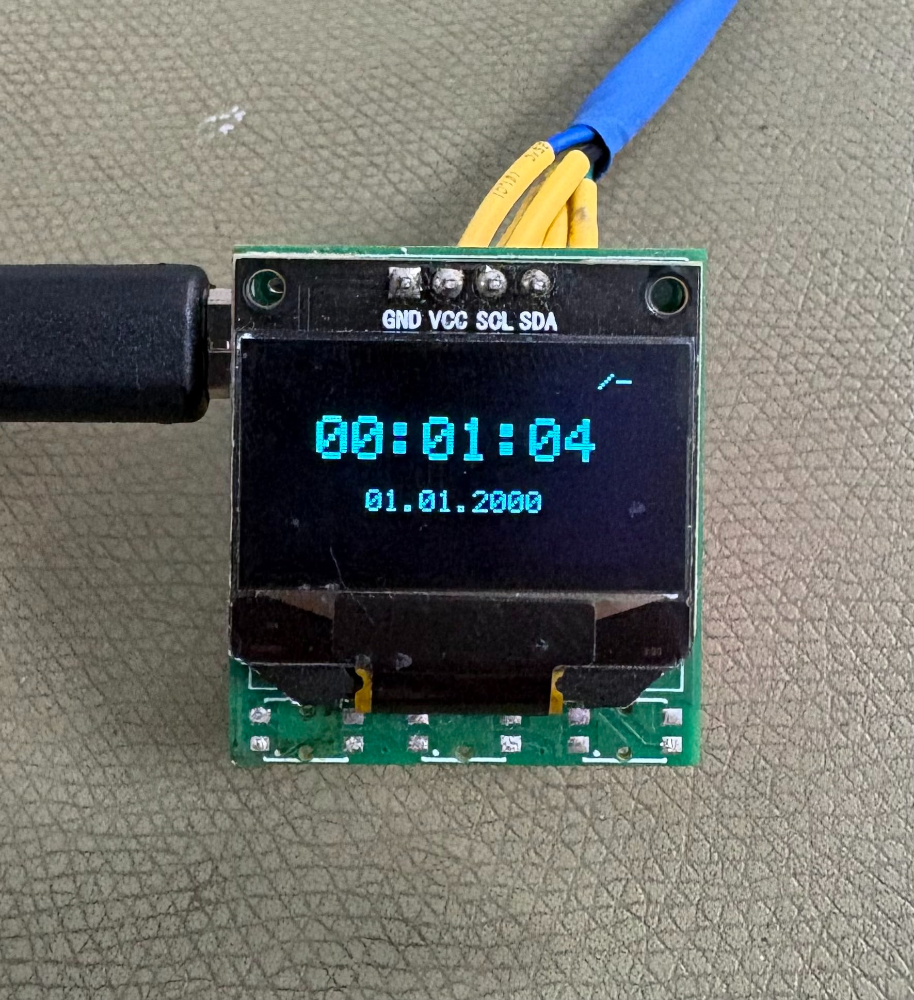
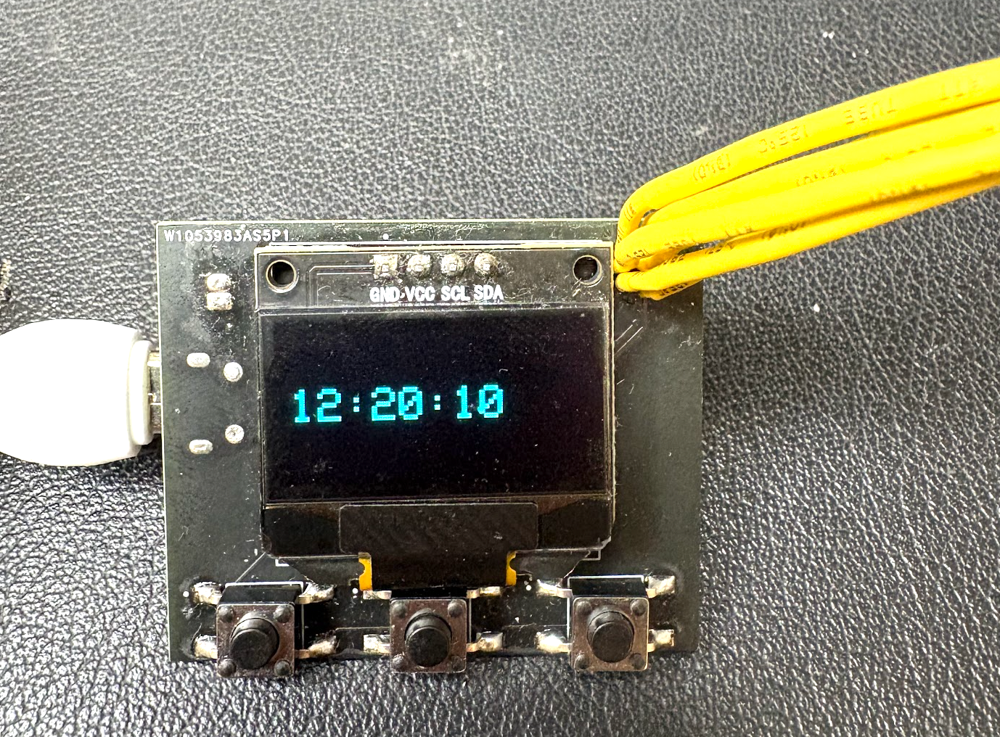

# opnwatch

**opnwatch** is an open-source wristwatch based on the ATmega328P microcontroller.

### Revision 2 of the PCB



### Revision 1 of the PCB



## Hardware

| Component | Part |
|-----------|------|
| Microcontroller | ATmega328P |
| Display | SSD1306 OLED |
| RTC | DS3231M |
| Charging IC | BQ24075RGT |
| PCB | Custom, designed in KiCad |

## Repository Structure

```
opnwatch/
├── CAD_files/        # KiCad schematic and PCB layout
    ├── rev2                # Revision 2 of the PCB
    └── rev3                # Revision 3 of the PCB
├── img/              # PCB and design images
└── watch_firmware/   # AVR-GCC firmware
    └── lib/
        └── oled-display/   # Vendored OLED library
```

## License

This project is open source. See [LICENSE](LICENSE) for details.
